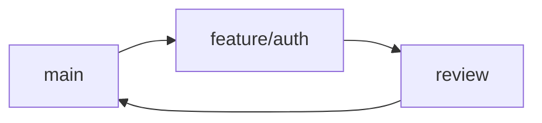

# Accessibility and media

Operational defaults for the rules a writer actually controls when accessibility and visual elements are involved. Lore docs are text-first and code-first; most pages will never include an image. Heading semantics, link text, and code-block requirements (also accessibility-relevant) live in [`../canon/format.md`](../canon/format.md) and [`../canon/language.md`](../canon/language.md). The site theme handles rendering-level accessibility (contrast ratios, focus indicators, semantic heading rendering); this file covers what the writer authors.

## Alt text

- Every non-decorative image requires alt text. Decorative images (purely ornamental dividers) don't — use an empty `alt=""` so screen readers skip them.
- Describe the **meaningful content** of the image (what the reader needs to take away), not what's depicted.
- Alt text is at least 5 words for non-decorative images.
- Don't begin alt text with `Image of` or `Picture of` — the screen reader already announces the role.
- For complex images (diagrams), put a short alt in the `alt` attribute and a longer description in the body or caption.
- Embedded video requires captions or a transcript.

```markdown

```

## Don't use color alone

Never rely on color alone to convey meaning. Pair color with a second cue: a label, a shape, an icon, an underline, a pattern.

- Bad: a status diagram where green = healthy and red = failing, with no other cue.
- Good: a green check icon for healthy, a red X icon for failing — the icon shape carries the meaning if color is lost.

## Code, not screenshots of code

Always use a fenced code block. Never a screenshot of a terminal or editor. Code in an image is unsearchable, uncopyable, untranslatable, and unreadable to screen readers.

## Don't bake text into images

Text rendered inside an image file is invisible to screen readers, search indexes, and translation tools. Layer text in Markdown alongside the image — never inside it.

For UI references, write the element name in prose, then place the image on its own line below:

```markdown
Click the **Create Branch** button in the lower-right corner.


```

## Publish-time self-check

Before publishing a page with media:

1. **Read the page aloud through a screen reader.** Use Narrator (Windows), VoiceOver (macOS), or Orca (Linux). Confirm the page makes sense and that Tab / Shift+Tab walks every interactive element.
2. **Confirm every non-decorative image has descriptive alt text.**
3. **Confirm no content conveys information by color alone.**
4. **Run [Lighthouse](https://developers.google.com/web/tools/lighthouse) on the rendered page** and address any findings before merge.

## Diagrams — Mermaid first

Author flowcharts, sequence diagrams, and architectural sketches in **Mermaid** when the doc site renders it. The source lives in the Markdown and stays diffable.

````markdown

````

For diagrams Mermaid can't express, author in a vector tool (Excalidraw, draw.io, similar) and export to **SVG**. Fall back to **PNG at 1200 px wide** if SVG isn't supported.

## File naming and placement

When you do include an image:

- **Lowercase, kebab-case** filenames: `commit-graph.png`, not `Commit-Graph.PNG`.
- **Lowercase extensions** — uppercase extensions break case-sensitive filesystems on Linux and CI: `.png`, not `.PNG`.
- Lead the filename with the subject: `branch-create-flow.png`, not `IMG_0001.png`.
- Place images alongside the doc that consumes them, in an `images/` subdirectory next to the `.md` file.

```text
docs/
  guides/
    branching/
      branching.md
      images/
        branch-create-flow.png
```

Place an image **on its own line, beneath the prose it supports.** Never embed an image inline inside a sentence — text-first ordering is required for screen-reader and translation flow.

## Don't capture personal data

No usernames, real file paths, project names, email addresses, real IPs, or license keys in any image. Use placeholders.

## What this file doesn't cover

- **Image contrast ratios for body text.** The site theme handles this. Verify with Lighthouse.
- **Heavy media production rules** — header / social / thumbnail images, video recording specs, GIF authoring, design-tool templates, screenshot editing for product UI. Lore docs don't author these.
- **WCAG conformance level negotiation.** Treat WCAG 2.1 AA as the working target unless the maintainers publish a different number.
